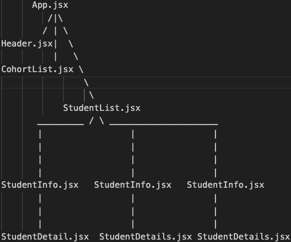

Netlify Link ---> <a href="https://pokedexboard.netlify.app/">Student Dashboard</a>

# Runquan (Ray) Zhou - Pursuit 10.6 N/W - Student Dashboard Project 

## Set Up Introduction

Welcome to the Student Dashboard Project.  The following will be a setup instruction to this project. 

1.  An initial layout of the page was drawn on Figma, with notes to components and functionality.  Please see link. ---> <a href="https://www.figma.com/file/1z92oJG3YAYQVIwFDnHvDz/Pursuit-Student-Dashboard-Project?type=design&node-id=0%3A1&mode=design&t=2oPY1kfyr83ofZkY-1">Figma Link</a>

2.  I fork and clone the repository onto my local machine.  A data.json file is provided with an array of 250 student objects, each with different keys and values.  Starting with an empty App.jsx, I make 3 children component, one is the Header.jsx, one is CohortList.jsx, the other is StudentList.jsx.

    -   Header.jsx component will have only a h1 element with the name of the webpage "Student Dashboard"
    -   CohortList.jsx component will display a list of each cohort on the left side of the page.  CohortList.jsx will have no children component under it.
    -   StudentList.jsx component will display the list of all the students is in the data.json file provided. Within the StudentList.jsx component, there is a StudentInfo.jsx child component that is rendered for each student object in the student array.  And within each StudentInfo.jsx component, there is a StudentDetails.jsx child component that will be rendered and display the individual student's academic status and also an 1-on-1 form for comments.

3.  Here is a map of the components.

    

4. There will be 4 css file to be utilized; an App.css, for the some general styling semantic elements, a CohortList.css to style the CohortList.jsx component, a StudentInfo.css to style the StudentInfo.jsx components, and lastly, a StudentDetails.css to style the StudentDetails.jsx component.