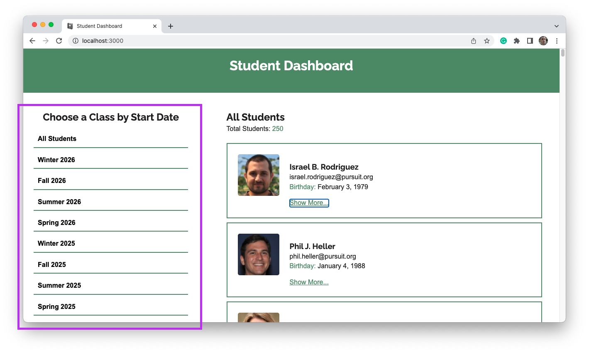
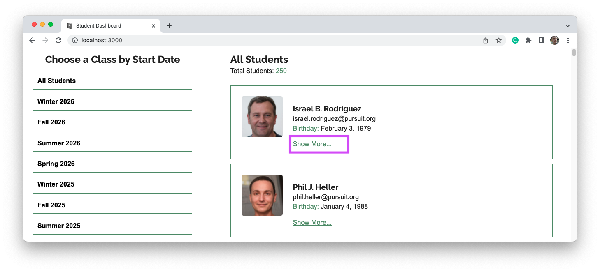

# Student Dashboard 

This React web application, named Student Dashboard, provides an intuitive interface for managing student information within various cohorts. The dashboard is divided into two main sections: the Cohort List and the Student List.

## Features

## Cohort List

This project has three different parts on which you will be graded. Each part is weighted differently.

- Located on the left side of the layout.
- Lists cohorts sorted by each season from 2025 to 2026.
- Clicking on a specific cohort displays only the active students belonging to that cohort.
- Includes a button labeled "All Students" to show all active students across cohorts.

### Student List

- Positioned on the right side of the layout.
- Displays student information including name, middle name, last name, email, and date of birth.
- Each student entry has a "Show More..." button.
- Clicking "Show More..." reveals additional student details such as certifications, CodeWars points, and a form for leaving comments on the student's profile.
- Features a tag in the upper right corner of the student profile indicating the student's progress towards graduation, based on accumulated certifications and CodeWars points.

## Cohort Title

- Located above the Student List.
- Displays the name of the currently selected cohort.
- Shows the total number of students belonging to that cohort.

## Usage 

1. Clone the repository.
1. Install dependencies using npm install.
1. Run the development server with npm start.
1. Access the application in your web browser at https://students-dashboard-nyc.netlify.app/

### Landing page

### Cohort list

### Cohort list on click

### Student list with "On-track"

### Student details section

### 1-on-1 section

